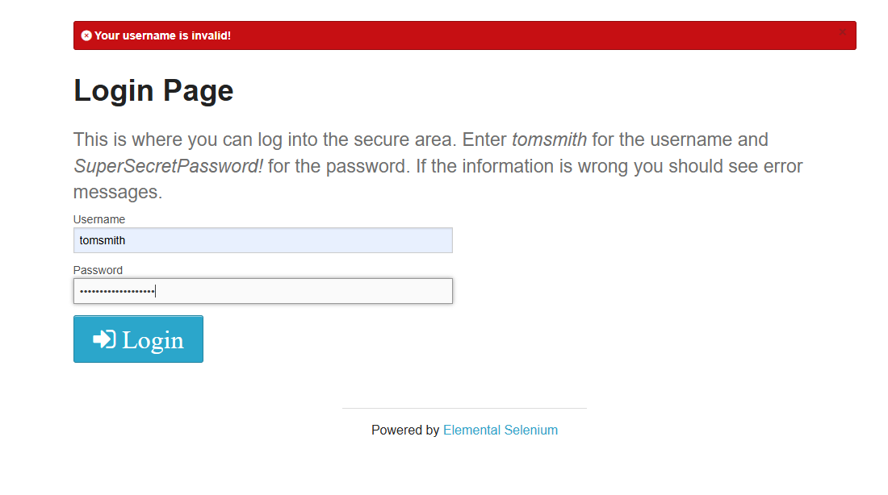

BUG-001 – Mensagem incorreta ao inserir senha inválida

**Ambiente:** Web – Opera GX  
**Prioridade:** Média  
**Severidade:** Baixa  

Pré-condição
Usuário válido cadastrado no sistema.

Passos para reproduzir
1. Acessar a página de login
2. Inserir username válido
3. Inserir senha inválida
4. Clicar em "Login"

Resultado esperado

Sistema deve exibir mensagem informando que a senha está incorreta ou que as credenciais são inválidas.

Resultado obtido

Sistema exibe mensagem informando que o username é inválido, mesmo quando o username informado é válido.

Evidência

Print anexado demonstrando a inconsistência da mensagem de erro.

